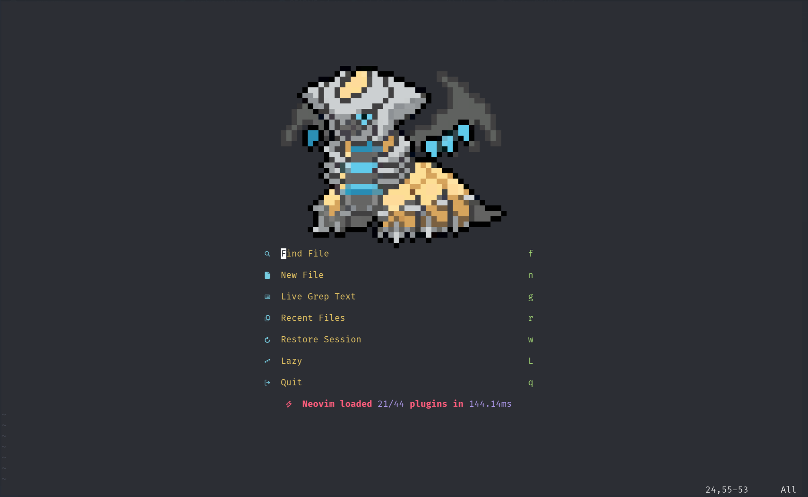
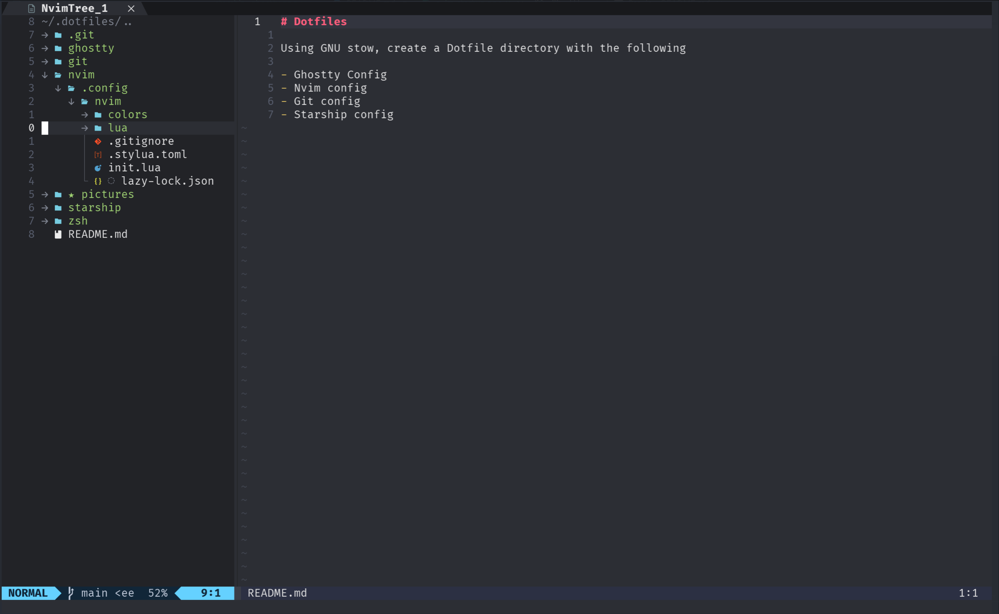

# Dotfiles

Using GNU stow, create a Dotfile directory with the following

- Ghostty Config
- Nvim config
- Git config
- Starship config
- \*NEW\* Hyprland config

# Examples:

## Ghostty Terminal with Starship for styling

## Nvim Setup

### Nvim startup page

### Nvim opened

